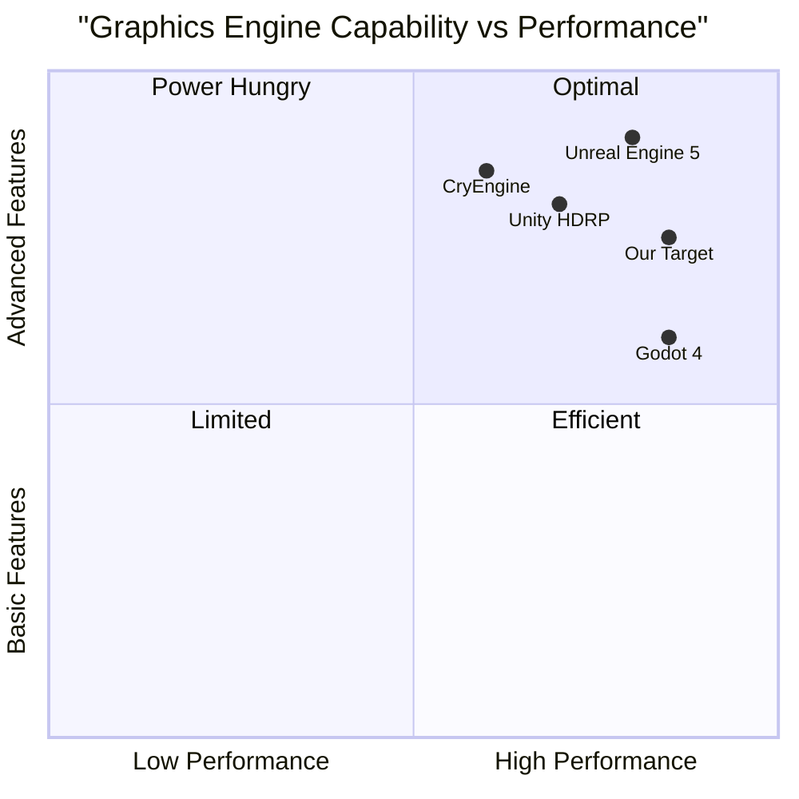

# Advanced Graphics System PRD

## 1. Project Overview

### 1.1 Project Name
advanced_graphics_system

### 1.2 Requirements Background
To enhance the visual quality and performance of the game through implementation of modern graphics features including HDR rendering, PBR materials, and GPU-accelerated particle systems.

### 1.3 Original Requirements
- Implement HDR rendering and post-processing pipeline
- Create PBR materials system with dynamic weathering
- Develop GPU-accelerated particle system

## 2. Product Goals

1. Achieve photorealistic rendering quality while maintaining 60+ FPS on target hardware
2. Implement industry-standard PBR workflow for consistent material appearance
3. Support large-scale particle effects without impacting performance

## 3. User Stories

1. As a player, I want to experience realistic lighting and HDR effects so that the game world feels more immersive
2. As an artist, I want a standardized PBR workflow so that materials look consistent across different lighting conditions
3. As a player, I want to see complex particle effects during combat and environmental interactions so that the game feels more dynamic
4. As a developer, I want efficient graphics systems so that the game maintains high performance

## 4. Competitive Analysis

Product Comparison:

1. Unreal Engine 5
- Pros: Lumen GI, Nanite geometry, robust material editor
- Cons: High hardware requirements, complex setup

2. Unity HDRP
- Pros: Integrated PBR workflow, shader graph
- Cons: Performance overhead, limited mobile support

3. Godot 4
- Pros: Open source, lightweight, Vulkan support
- Cons: Limited advanced features, smaller ecosystem

4. CryEngine
- Pros: Advanced lighting, established PBR pipeline
- Cons: Resource intensive, steep learning curve

5. Custom AAA Game Engines (Frostbite, RE Engine)
- Pros: Highly optimized, cutting-edge features
- Cons: Proprietary, unavailable for general use



## 5. Technical Specifications

### 5.1 HDR Rendering Pipeline

P0 Requirements:
- Must implement HDR rendering with 16-bit per channel color depth
- Must support tone mapping with multiple operator options
- Must achieve 60+ FPS at 1440p on target hardware

P1 Requirements:
- Should support bloom effects with configurable parameters
- Should implement light adaptation system
- Should support color grading LUTs

P2 Requirements:
- May include advanced effects like lens flare
- May support HDR display output

### 5.2 PBR Material System

P0 Requirements:
- Must support metallic/roughness workflow
- Must implement energy-conserving BRDF
- Must support normal mapping and ambient occlusion

P1 Requirements:
- Should support dynamic material weathering
- Should include material layering system
- Should support parallax occlusion mapping

P2 Requirements:
- May include subsurface scattering
- May support advanced anisotropic materials

### 5.3 GPU Particle System

P0 Requirements:
- Must support 100,000+ particles with minimal performance impact
- Must implement particle collision detection
- Must support basic force fields

P1 Requirements:
- Should support particle sorting for transparency
- Should include particle life cycle management
- Should implement particle attraction/repulsion

P2 Requirements:
- May support fluid simulation
- May include particle light emission

## 6. UI Design Draft

### 6.1 Material Editor Layout
```
+------------------------+
|  Preview   |  Settings |
|           |   Panel   |
|           |           |
+------------------------+
|     Property Grid      |
|                        |
+------------------------+
```

### 6.2 Particle Editor Layout
```
+------------------------+
|  Viewport  |  Params  |
|           |          |
|           |          |
+------------------------+
|    Timeline/Controls   |
+------------------------+
```

## 7. Open Questions

1. Hardware Support
- What is the minimum supported GPU generation?
- Should we support multiple graphics APIs (Vulkan/DX12/Metal)?

2. Performance Targets
- What are the specific FPS targets for different quality presets?
- How should we handle degradation on lower-end hardware?

3. Integration
- How will the new systems integrate with existing rendering code?
- What is the migration path for existing assets?

## 8. Success Metrics

1. Performance
- Maintain 60+ FPS at 1440p on target hardware
- Keep GPU memory usage under 4GB
- Particle system supporting 100,000+ particles

2. Quality
- HDR rendering matching reference images
- PBR materials matching real-world reference
- Particle effects matching concept art

3. Development
- Complete implementation within 3 months
- Pass all automated graphics tests
- Meet memory budget requirements