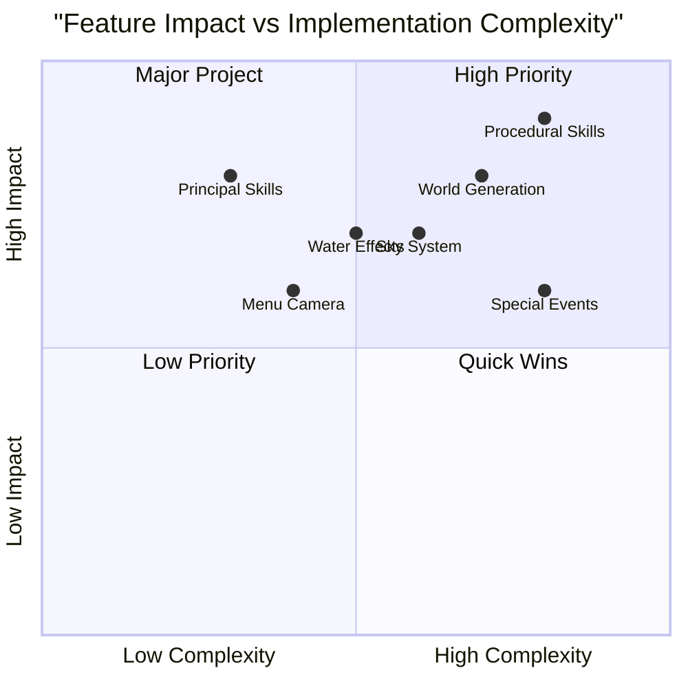

# Nightfall Defenders: Enhanced Edition PRD

## 1. Project Overview

### 1.1 Original Requirements
Enhance the endgame content and visual quality of Nightfall Defenders with:
- Procedural skill generation system
- Enhanced class-based skill system
- Dynamic main menu with environmental showcase
- Advanced visual effects and world generation

### 1.2 Development Stack
- Game Engine: Current engine with HD-2D pipeline
- Programming Language: Current implementation
- Visual Style: Enhanced HD-2D (Octopath Traveler style)

## 2. Enhanced Skill System

### 2.1 Principal Skills (P0)
- Each class MUST have 6 distinctive principal skills
- Skills MUST follow the evolution path described in original PRD
- Each principal skill MUST have 3 evolution branches

#### Example for Warrior Class
1. Blade Storm
   - Branch A: Tornado Blade (AoE focus)
   - Branch B: Precision Strike (Single target)
   - Branch C: Endless Slashes (Multi-hit)

2. Shield Wall
   - Branch A: Reflective Barrier
   - Branch B: Mobile Fortress
   - Branch C: Energy Shield

[Similar structure for remaining 4 skills]

### 2.2 Procedural Skill Generation (P0)

#### Activation Requirements
- MUST unlock after reaching max level (50)
- MUST be tied to Paragon system progression

#### Generation Rules
1. Base Components
   - Skill Type (Attack, Defense, Utility)
   - Element (Fire, Ice, Lightning, etc.)
   - Delivery Method (Projectile, AoE, Buff, etc.)

2. Modifier System
   - Primary Modifier (Changes core behavior)
   - Secondary Modifier (Adds effects)
   - Scaling Modifier (Affects numbers)

3. Class Restrictions
   - Generated skills MUST align with class theme
   - MUST respect class resource systems
   - MAY combine elements from different classes

#### Example Generation
Warrior Procedural Skill:
```
Base: Attack Skill
Element: Fire
Delivery: Sweep
Primary: Echoing (Repeats 3 times)
Secondary: Burning (DoT effect)
Scaling: Increases with Strength
```

## 3. Dynamic Main Menu

### 3.1 Camera System (P0)

#### Requirements
- MUST implement dynamic POV camera system
- MUST showcase generated world environments
- MUST support seamless transitions

#### Camera Behaviors
1. Main State
   - Slow panning across landscape
   - Subtle camera movements (floating)
   - Dynamic focus points

2. Transition State
   - Smooth transitions between points of interest
   - Depth of field adjustments
   - Motion blur during movement

### 3.2 Environment Showcase (P0)

#### World Generation
- MUST generate unique landscape for menu background
- MUST include key visual elements from game
- SHOULD vary based on time of day

#### Visual Features
- Water bodies with reflections
- Dynamic cloud systems
- Atmospheric effects
- Day/night cycle

### 3.3 Special Events (P1)
- Aurora Borealis displays
- Thunderstorms with lightning
- Meteor showers
- Cherry blossom storms

## 4. Advanced Visual Effects

### 4.1 Water System (P0)
- Real-time reflections
- Dynamic ripple effects
- Caustics and subsurface scattering
- Interactive water physics

### 4.2 Sky System (P0)
- Volumetric clouds
- Dynamic weather patterns
- Realistic day/night transitions
- Atmospheric scattering

### 4.3 Special Effects (P1)
- Aurora Borealis system
- Advanced particle systems
- Dynamic shadows
- God rays and lens flares

### 4.4 World Events (P1)
- Automated camera focus on events
- Cinematic transitions
- Dynamic lighting adjustments
- Environmental reactions

## 5. World Generation Improvements

### 5.1 Terrain Enhancement (P0)
- Improved height map generation
- Better biome transitions
- More varied landscapes
- Enhanced detail maps

### 5.2 Environment Population (P0)
- Smarter object placement
- Dynamic erosion simulation
- Realistic vegetation distribution
- Improved city placement

### 5.3 Detail Systems (P1)
- Micro-detail generation
- Enhanced foliage system
- Dynamic resource placement
- Weather-based changes

## 6. Technical Requirements

### 6.1 Performance Targets
- Maintain 60 FPS on target hardware
- Maximum load time of 3 seconds for menu
- Texture memory budget: 4GB
- Polygon budget: 1M triangles per frame

### 6.2 Quality Settings
- Multiple quality presets
- Scalable effect systems
- Dynamic resolution support
- Configurable visual features

## 7. Development Priorities

### Phase 1 (P0)
1. Principal skill system implementation
2. Basic procedural skill generation
3. Main menu camera system
4. Basic visual improvements

### Phase 2 (P1)
1. Advanced procedural skills
2. Special visual effects
3. Enhanced world generation
4. Environmental events



## 8. Open Questions
1. Should procedural skills have a maximum generation limit?
2. How should weather events be distributed in the main menu?
3. What are the minimum hardware requirements for enhanced visuals?
4. How will the procedural skill system scale with future content?

## 9. Success Metrics
1. Player engagement with procedural skills
2. Time spent in endgame content
3. Visual satisfaction ratings
4. Performance metrics on target platforms
